# 🔄 End-to-End CI/CD Pipeline on AWS with Docker, ECR & EC2

This project showcases a fully automated, production-style CI/CD pipeline built using AWS cloud services to seamlessly build, containerize, and deploy a web application to an EC2 instance. The pipeline is orchestrated using AWS CodePipeline, integrating source control, automated builds, container image management, and deployment — all with zero manual intervention.


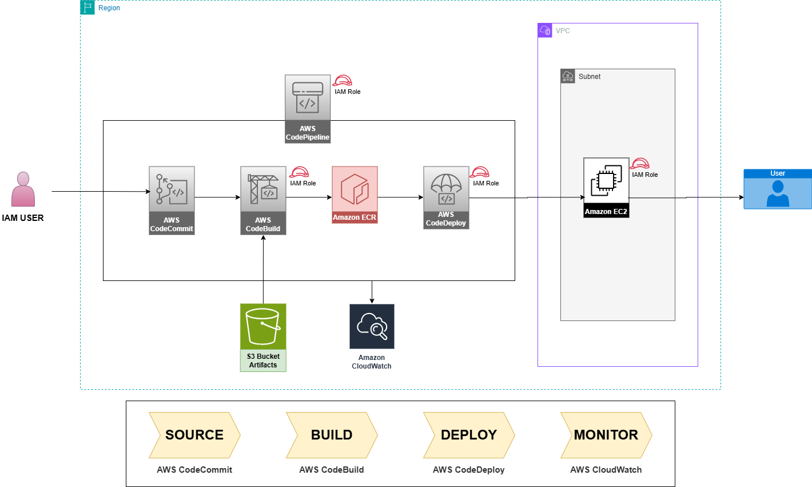

---

## 📌 Project Overview

This project demonstrates a complete CI/CD pipeline on AWS using:

- **AWS CodeCommit** – Source repository

- **AWS CodeBuild** – Build Docker image

- **Amazon ECR** – Store Docker image

- **AWS CodeDeploy** – Deploy to EC2

- **Amazon EC2** – Application server

- **Docker + Nginx** – Containerized application

The pipeline automatically builds and deploys the application whenever code is pushed to AWS CodeCommit.

---

## 🏗️ Architecture Flow
```
Developer → CodeCommit → CodePipeline → CodeBuild → ECR → CodeDeploy → EC2 → Docker Container
```
- Developer pushes code to CodeCommit

- CodePipeline triggers automatically

- CodeBuild builds Docker image

- Image pushed to Amazon ECR

- CodeDeploy deploys to EC2

- Docker container runs application

- App accessible via EC2 Public IP
```
http://<EC2-PUBLIC-IP>:8080
```
## 📂 Project Structure

```
Project-repo/
│
├── Dockerfile
├── .dockerignore
├── index.html
├── styles.css
├── script.js
├── appspec.yml
├── buildspec.yml
└── scripts/
    ├── start_container.sh
    └── stop_container.sh
```

---

## ⚙️ AWS Services Used

- Amazon EC2
- Amazon ECR (Public)
- AWS CodeCommit
- AWS CodeBuild
- AWS CodeDeploy
- AWS CodePipeline
- IAM Roles
- AWS S3
- AWS CloudWatch
---
## 📝 Important Note

⚠️ All commands in this project were executed using **VS CODE** Terminal and **Command Prompt**.

---
## 🛠️ Setup Guide :
Follow these steps to recreate the full end-to-end pipeline.


### 🔹 Step 1 : Install Git VS Code :
**1. Install Git -**
  - Go to : 
```
https://git-scm.com/downloads
```

- Download Git for Windows

- Install with default settings

- After installation, verify : ```git --version```

- If you see something like : ```git version 2.x.x```

- Git is installed successfully.

- Set your username and email (Configure Git): 
   
   -> Open **CMD** and type -
```
git --version
git config --global user.name "Your Name"
git config --global user.email "your-email@example.com"
```
- Check configuration:
```
git config --list
```


**2. Install VS Code -**
- Download: 
```
https://code.visualstudio.com/
```
---
###  🔹 Step 2 : Create IAM User 👤(Important – Do Not Use Root User)

⚠️ Root user should never be used for development activities.

**1. Create IAM User -**
- Go to AWS Console → IAM
- Click **Users → Create user**
- User name: `IAM-USER-GIT`
- Enable : Provide user access to the AWS Management Console
- Choose Autogenerated Passowrd and click next
- Attach policies:
```
AWSCodeCommitPowerUser
```
- Download access key & secret key (if needed).

**2. Configure Git Credentials for CodeCommit -**
- Go to IAM
- Select your IAM user
- Go to Security credentials

- Scroll to HTTPS Git credentials for AWS CodeCommit
- Click Generate credentials
- Download the username & password

These credentials are only for Git, not AWS console login.


---
### 🔹 Step 3 : Create CodeCommit Repository  

- Go to AWS Console → CodeCommit

- Click Create repository

- Name: `Project-repo`

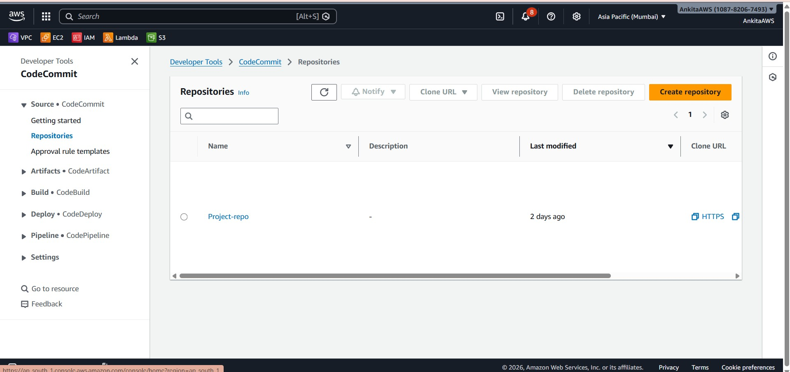

---

###  🔹Step 4 : Create Amazon ECR Repository

- Open Amazon ECR

- Click Create repository

- Repository name : `ci-cd-repo`
- Leave other settings default and click create

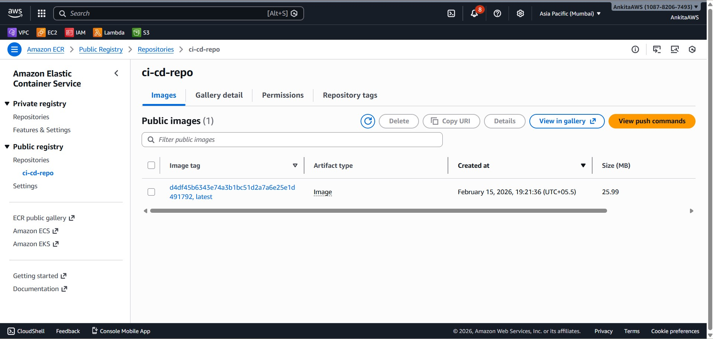

--- 
### 🔹 Step 5 : Open VS Code & Clone Repository

- Open VS Code 
- Open Terminal
- Run:
```
git clone https://git-codecommit.ap-south-1.amazonaws.com/v1/repos/Project-repo
```
- When prompted:
```
Username → IAM HTTPS Git username
Password → IAM HTTPS Git password
```
- Now move into folder:
```
cd Project-repo
```
---
### 🔹 Step 6 : Create Application Files

Inside VS Code:

**1. Create index.html -**
```
<!DOCTYPE html>
<html lang="en">
<head>
    <meta charset="UTF-8">
    <title>Profile Summary</title>
    <link rel="stylesheet" href="styles.css">
</head>
<body>

    <div class="container">
        <h1>About Me</h1>
        <p id="content"></p>
    </div>

    <script src="script.js"></script>
</body>
</html>

```
**2. Create styles.css -**
```
body {
    margin: 0;
    padding: 0;
    font-family: Arial, Helvetica, sans-serif;
    background: linear-gradient(135deg, #667eea, #764ba2);
    height: 100vh;
    display: flex;
    justify-content: center;
    align-items: center;
}

.container {
    background-color: #ffffff;
    width: 70%;
    max-width: 800px;
    padding: 30px;
    border-radius: 12px;
    box-shadow: 0 10px 25px rgba(0, 0, 0, 0.2);
}

h1 {
    text-align: center;
    color: #333;
    margin-bottom: 20px;
}

p {
    font-size: 16px;
    line-height: 1.7;
    color: #555;
    text-align: justify;
}

```
**3. Create script.js -**
```
const text = `I am an Associate Software Engineer with a strong interest in cloud computing and backend technologies. I recently earned the AWS Certified Cloud Practitioner certification, strengthening my understanding of AWS core services, cloud architecture, security, and pricing models.

I enjoy building and learning through hands-on projects, especially on AWS, where I focus on creating scalable and efficient solutions. My technical foundation includes C, C++, Java, SQL, DBMS, along with experience using Git, GitHub, and Docker.`;

document.getElementById("content").innerText = text;

```
---
### 🔹 Step 7 : Create Dockerfile

- Create file named : `Dockerfile`

- Add:
```
FROM nginx:alpine

RUN rm -rf /usr/share/nginx/html/*

COPY . /usr/share/nginx/html/

EXPOSE 80

CMD ["nginx", "-g", "daemon off;"]
```
---
### 🔹Step 8 : Create buildspec.yml 
- Get Details from ECR
```
Got to ECR → Your Repository → Click “View push commands”
```
You will see something like:
```
aws ecr get-login-password --region ap-south-1 | docker login --username AWS --password-stdin 123456789012.dkr.ecr.ap-south-1.amazonaws.com

docker build -t my-app .

docker tag my-app:latest 123456789012.dkr.ecr.ap-south-1.amazonaws.com/my-app:latest

docker push 123456789012.dkr.ecr.ap-south-1.amazonaws.com/my-app:latest
```
We will convert this into buildspec.yml.
```
version: 0.2

env:
  variables:
    AWS_DEFAULT_REGION: ap-south-1
    REPOSITORY_URI: public.ecr.aws/s2q8f2k8
    ECR_REPO_NAME: ci-cd-repo
    ECR_PUBLIC_AUTH_REGION: us-east-1

phases:
  pre_build:
    commands:
      - echo "Setting image tag..."
      - IMAGE_TAG=${CODEBUILD_RESOLVED_SOURCE_VERSION:-latest}
      - echo "Logging in to Amazon ECR Public..."
      - aws ecr-public get-login-password --region $ECR_PUBLIC_AUTH_REGION | docker login --username AWS --password-stdin public.ecr.aws

  build:
    commands:
      - echo "Build started on $(date)"
      - docker build -t $ECR_REPO_NAME:$IMAGE_TAG .
      - docker tag $ECR_REPO_NAME:$IMAGE_TAG $REPOSITORY_URI/$ECR_REPO_NAME:$IMAGE_TAG
      - docker tag $ECR_REPO_NAME:$IMAGE_TAG $REPOSITORY_URI/$ECR_REPO_NAME:latest

  post_build:
    commands:
      - echo "Pushing Docker images..."
      - docker push $REPOSITORY_URI/$ECR_REPO_NAME:$IMAGE_TAG
      - docker push $REPOSITORY_URI/$ECR_REPO_NAME:latest
      - echo "Build completed on $(date)"

artifacts:
  files:
    - appspec.yml
    - scripts/**/*
```

### 🔹Step 9 : Push Code to CodeCommit

Inside VS Code terminal run following commands:
```
git add .
git commit -m "Initial commit"
git push origin master
```
Now code is stored in CodeCommit.

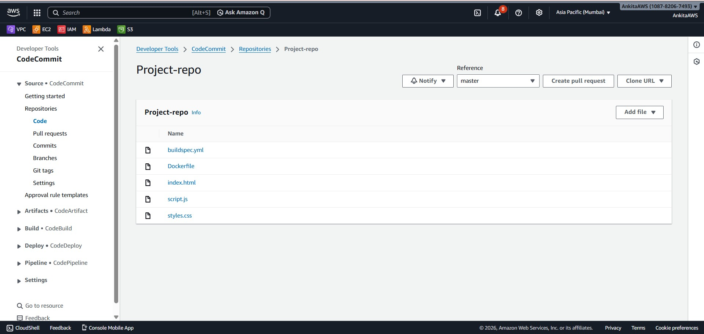

---
### 🔹Step 10 : Create S3 Bucket for Artifacts 
- Open AWS Console

- Search → S3

- Click Create bucket
- Bucket Type : General purpose
- Name : `project-ci-cd2026`
- Leave other setting default and Click on **Create bucket**

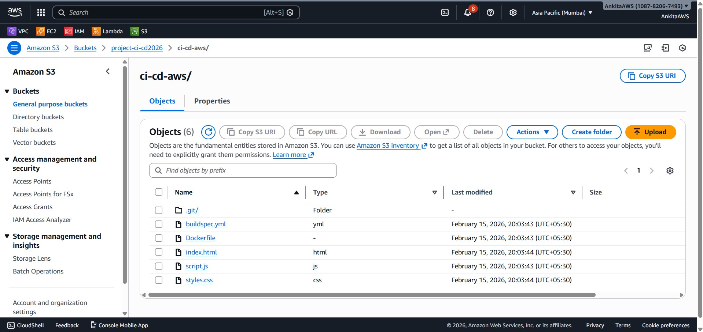

---
### 🔹Step 11 : Create CodeBuild Project
**1. Project configuration -**
- Project name : `ci-cd-build`
- Project type : Default project

**2. Source -**
- Source provider : AWS CodeCommit
- Repository : Project-repo
- Branch : master

  ⚠️If your main branch is **main**, change it to **main**. Only keep **master** if your repo actually uses main branch as **master**.

**3. Environment -**
- Provisioning model : On-demand
- Environment image : Managed image
- Compute : EC2
- Running mode : Container
- Operating System : Amazon Linux
- Runtime : Standard
- Image : aws/codebuild/amazonlinux-x86_64-standard:5.0
- Image version : Always use the latest image for this runtime version
- Service role : Choose create a New service role.
(AWS will automatically create a proper role.)
- Enter role name : `codebuild-ci-cd-service-role`


**4.Buildspec -**
- Build specifications : Use a buildspec file

Since you already created buildspec.yml inside your repo. Do NOT paste commands manually.

**5.Artifacts -**
- Type: Amazon S3
- Bucket: project-ci-cd2026
- Name: cicd-aws
- Packaging: None

**6. Logs -**
- Enable CloudWatch Logs

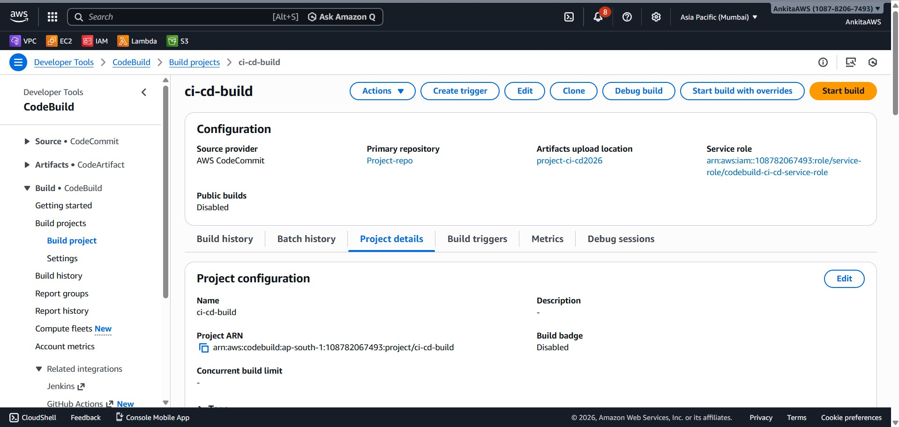

---
### 🔹Step 12 : Create Deployment Files
**Inside VS Code:**

**1. Create appspec.yml -**
```
version: 0.0
os: linux

hooks:
  BeforeInstall:
    - location: scripts/stop_container.sh
      timeout: 300
      runas: root

  ApplicationStart:
    - location: scripts/start_container.sh
      timeout: 300
      runas: root
```
**2. Create folder -** `scripts`

  - Inside scripts folder create:

**a. start_container.sh -**
```
#!/bin/bash

docker pull public.ecr.aws/s2q8f2k8/ci-cd-repo:latest

docker stop app || true
docker rm app || true

docker run -d --name app -p 8080:80 public.ecr.aws/s2q8f2k8/ci-cd-repo:latest
```
**b. stop_container.sh -**
```
#!/bin/bash

if [ "$(docker ps -q -f name=webapp)" ]; then
    echo "Stopping existing container..."
    docker stop webapp
    docker rm webapp
else
    echo "No existing container found."
fi
```
**3. Create .dockerignore file -**
```
appspec.yml
buildspec.yml
scripts/
```
The .dockerignore file is used to exclude unnecessary files and folders from the Docker build context when building an image. 

---
### 🔹Step 13 : Push Code to CodeCommit
Inside VS Code terminal run following commands:
```
git add .
git commit -m "Deployment files"
git push origin master
```
Now code is stored in CodeCommit.

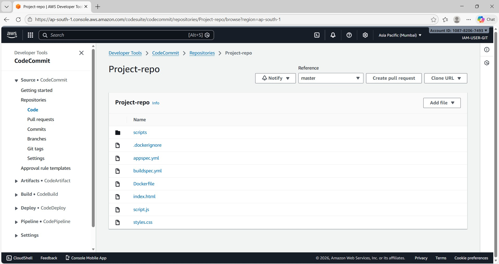

---

### 🔹Step 14 : Create an EC2 Instance -
- Go to the AWS Management Console

- Search for EC2

- Click EC2 Dashboard

- Click on Launch a New Instance

- Enter a descriptive name : `ci-cd-pipeline`

-  Choose an OS : Amazon Linux 2023 (recommended)
- Choose Instance Type : 2.micro (Free Tier Eligible)
- Create or Select a Key Pair : 


   -> Name : `ci-cd-pipeline`

  -> Key pair type: RSA

This key allows you to SSH into the instance. Save the .pem file securely
(You cannot download it again!)

- Click Edit under Network settings:

  -> Choose your default VPC or custom VPC.

  -> Choose a public subnet.

   -> Enable Auto-assign Public IP

- Add inbound rules for security group :
```
| Type        | Port | Source   | Purpose        |
|-------------|------|----------|----------------|
| SSH         | 22   | My IP    | SSH login      |
| HTTP        | 80   | Anywhere | Web traffic    |
| HTTPS       | 443  | Anywhere | Secure web     |
| Custom TCP  | 8080 | Anywhere | Node.js app    |

```
- Click : Launch Instance

Your EC2 instance will start in 1–2 minutes.

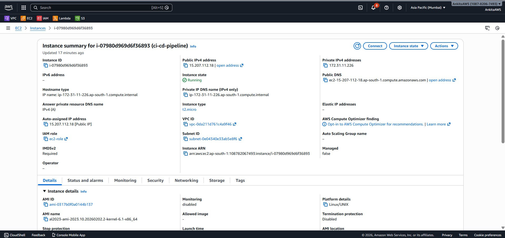

---
### 🔹Step 15 : Connect to EC2 and Install Docker and Install Codedeploy Agent 
**1. Connect to EC2 instance -**

- Go inside instance and click on **connect**

- Open CMD and type :
```
ssh -i ci-cd-key.pem ec2-user@<EC2-Public-IP>
```
This will connect to ec2 instance successfully.

**2. Install Docker -**
```
sudo yum update -y
sudo yum install docker -y
sudo service docker start
sudo systemctl enable docker
sudo usermod -aG docker ec2-user
```
- Logout : `exit`

- login again : `ssh -i ci-cd-key.pem ec2-user@<IP>`

- Check docker version : `docker --version`

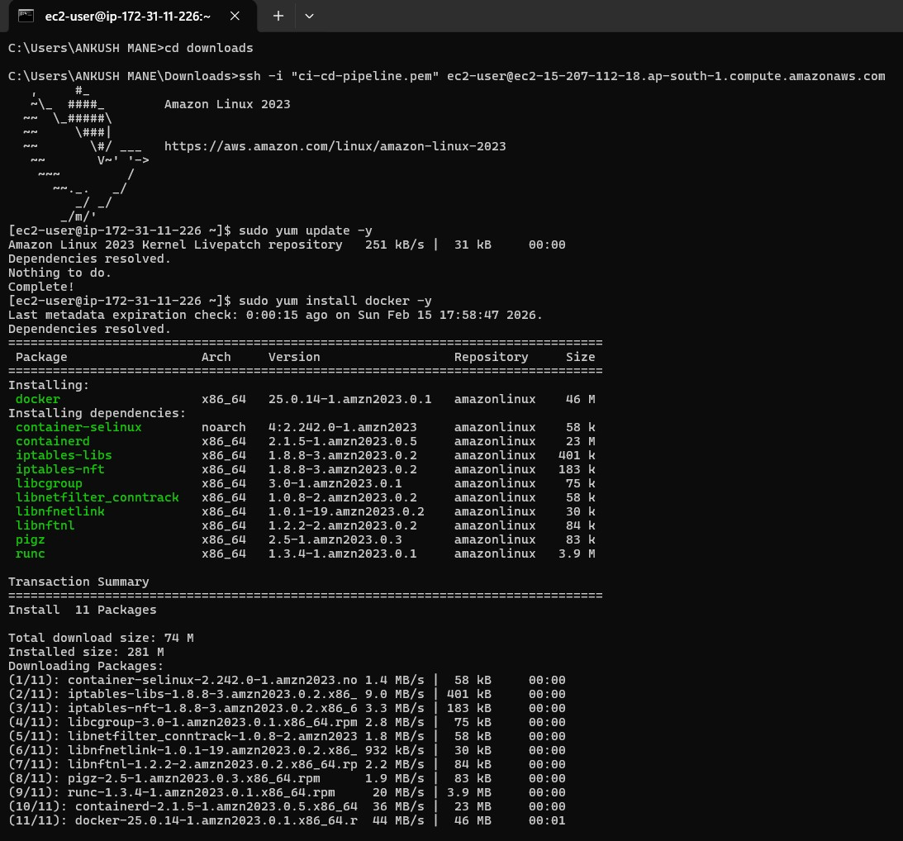
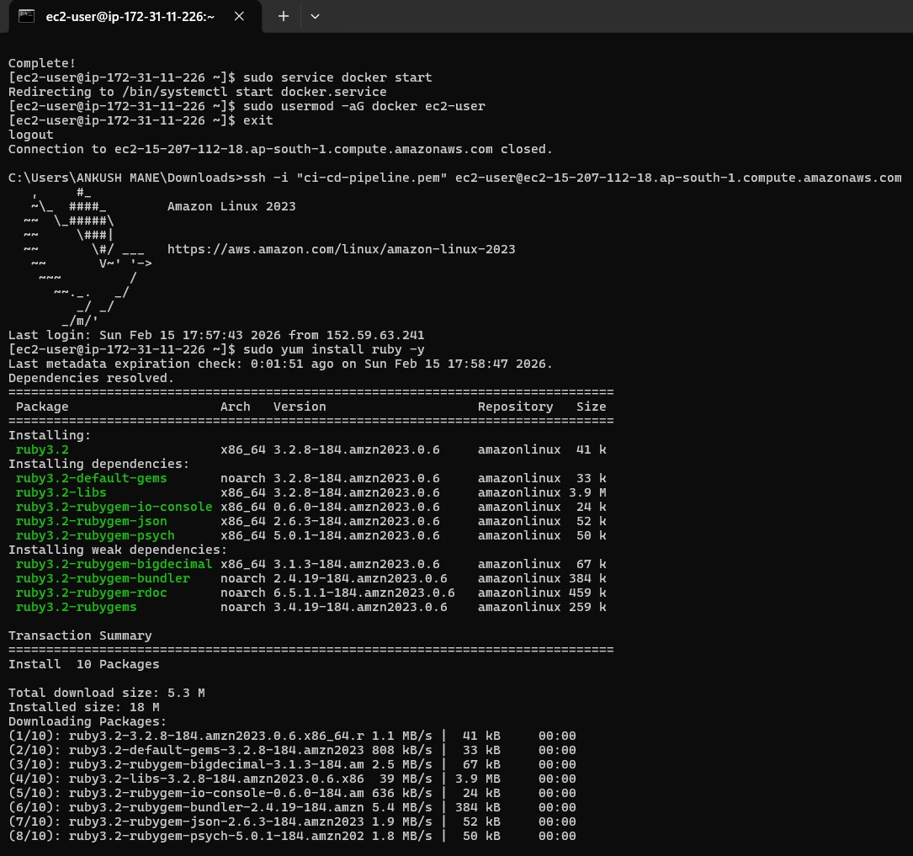

**3. Install CodeDeploy Agent -**
- CodeDeploy requires Ruby.
```
sudo yum install ruby -y
sudo yum install wget -y
```
- Download agent (ap-south-1 example):
```
cd /home/ec2-user
wget https://aws-codedeploy-ap-south-1.s3.ap-south-1.amazonaws.com/latest/install
chmod +x install
sudo ./install auto
```
- Start service:
```
sudo service codedeploy-agent start
sudo systemctl enable codedeploy-agent
```
- Check status:
```
sudo service codedeploy-agent status
```
- Should show : `running`

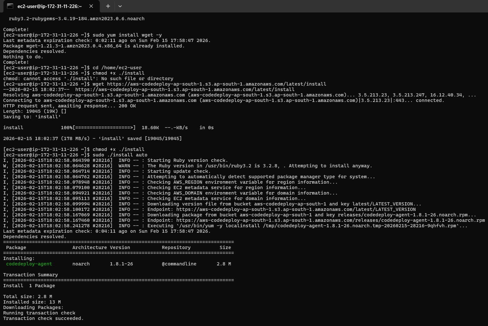
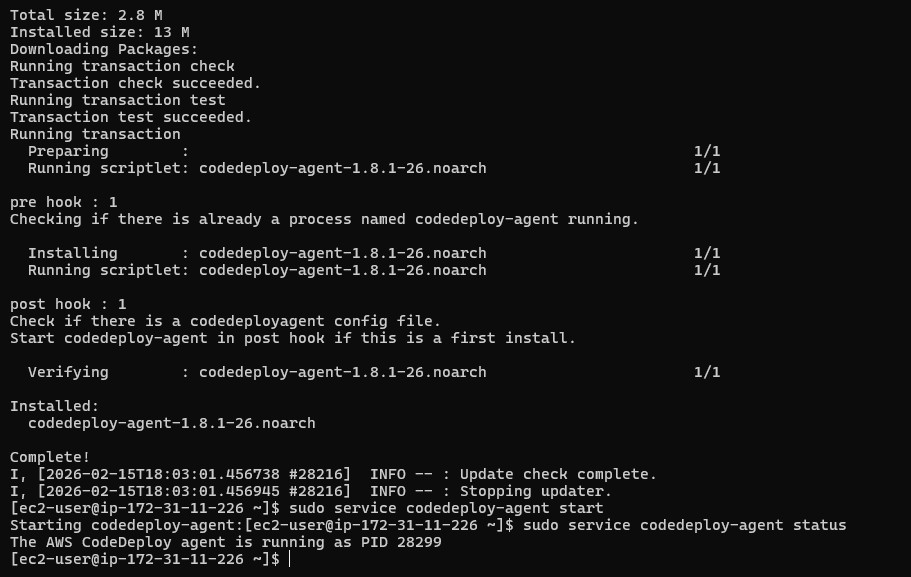

---
### 🔹Step 16 : Tag EC2 Instance

- Go to EC2 dashboard
- Go to Instances 
- Go to Actions
- Choose Instance Settings
  - Under Instance Settings, Choose Manage tags 
- Add Tag:
```
Key: Name
Value: ci-cd-pipeline
```
CodeDeploy will use this tag to identify instance.

---
### 🔹Step 17 : Create IAM role for EC2 Instance and Attach it 
**1. Create IAM Role -**
- Go to IAM
- Click on role
- Click on create role
- Name : `ec2-role`
- Choose Trusted entity type : AWS service
- Chose Service or use case : EC2
- Click on next
- Choose custom policy(JSON) :
```
{
    "Version": "2012-10-17",
    "Statement": [
        {
            "Action": [
                "s3:GetObject",
                "s3:GetObjectVersion",
                "s3:ListBucket"
            ],
            "Effect": "Allow",
            "Resource": "*"
        }
    ]
}
```
- Click next
- Review and Create
- Again go to IAM role and click on Add Permissions
- Add AWS Managed Policy :
```
AmazonEC2RoleforAWSCodeDeploy
```
- Click Add Permissions

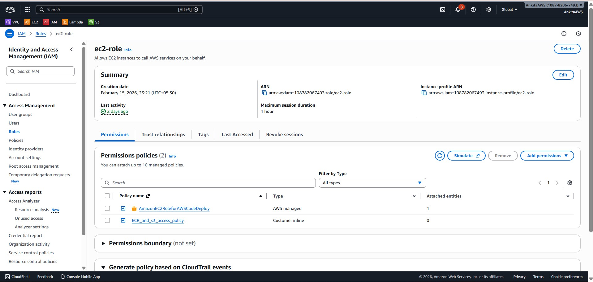

**2. Attach role to EC2 Instance -**
- Now go to EC2 Instance 
- Click on Actions
- Choose Security
- Choose Modify IAM role
- Choose role : `ec2-role`
- Click attach

---
### 🔹Step 18 : Create CodeDeploy Application and Deployment Group
**1. Create Application -**

- Go to AWS CodeDeploy

- Click on Create application
- Application Name : `ci-cd-application`
- Compute Platform : EC2/On-premises
- Click create application

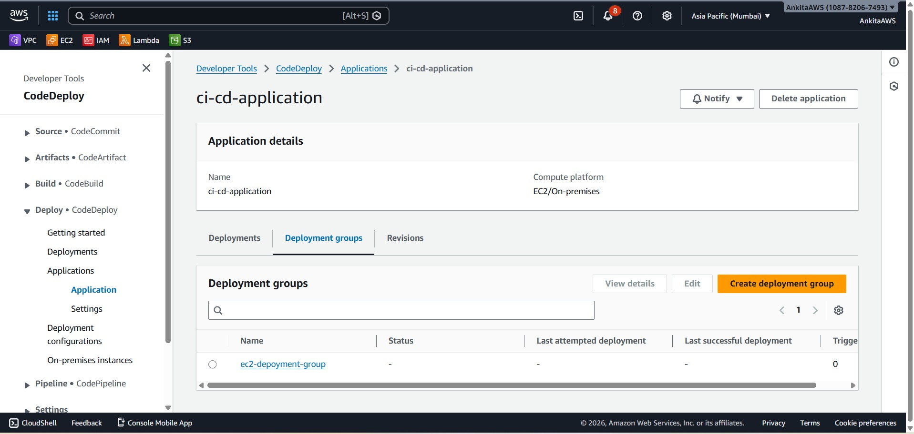

**2. Create Deployment Group -**
- Give Deployment Group Name : `ec2-depoyment-group`
- Service role : Create a new service role. (AWS will automatically create a proper role.)
- Choose deployment type : In-place
- Choose Environment Configuration : Amazon EC2 instances

  -> Select:
```
Key: Name
Value: ci-cd-server
```
(This matches EC2 tag.)

- Choose Deployment Settings: CodeDeployDefault.AllAtOnce

- Load Balancer : Uncheck (for now)
- Click Create deployment group

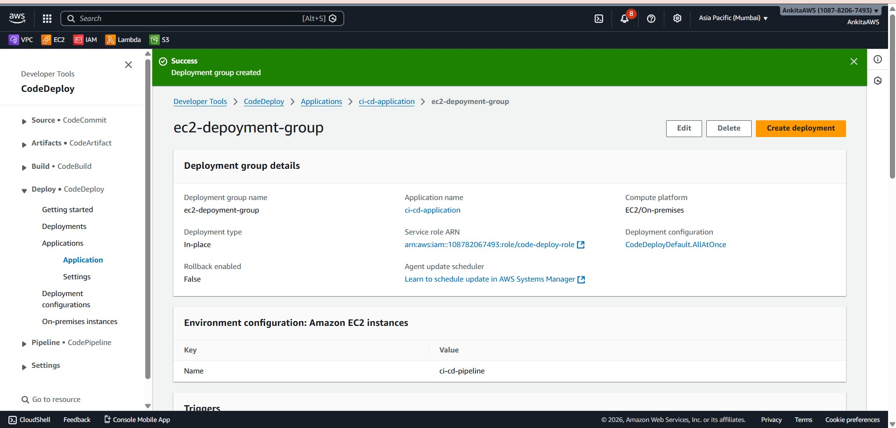

---
### 🔹Step 19 : Create CodePipeline

- AWS Console → Search → CodePipeline
- Click : Create pipeline

**1. Choose creation option -**
- Choose category : Build custom pipeline
- click next

**2. Choose pipeline settings  -**
- Enter Pipeline name - `ci-cd-pipeline`
- Choose Execution mode : Queued
- Service role : New service role
- Enter Role name : `
AWSCodePipelineServiceRole-ap-south-1-ci-cd-pipeline`. (AWS will automatically create a proper role.)
- Click next

**3. Add source stage -**
- Choose source provider : AWS CodeCommit
- Choose Repository name : Project-repo
- Branch name : master
- Enbale : Create EventBridge rule to automatically detect source changes
- Output artifact format : CodePipeline default
- Enable automatic retry on stage failure
- Click next

**4. Add build stage -**
- Build provider : Other build providers
- Choose CodeBuild
- Choose Project name : ci-cd-build
- Choose Build type : Single build
- Choose Region : Asia Pacific (Mumbai)
- Choose Input artifacts : SourceArtifacts
- Click next

**5. Add deploy stage -**
- Choose Deploy provider : AWS CodeDeploy
- Choose Region : Asia Pacific (Mumbai)
- Choose Input artifacts : SourceArtifacts
- Choose Application name : ci-cd-application
- Deployment group : ec2-depoyment-group
- Enable : Configure automatic rollback on stage failure
- Click next
- Review and Click on **Create Pipeline**
---

### 🌍 Test It

Make small change in index.html

Then:
```
git add .
git commit -m "test pipeline"
git push
```
Pipeline will automatically trigger.

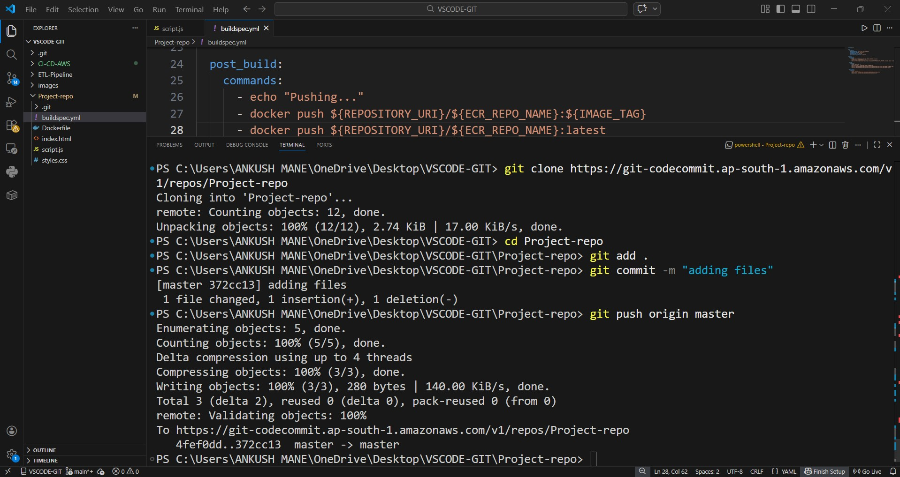

---

### 🎯If Everything Is Correct

You will see:
```
Source → Succeeded
Build → Succeeded
Deploy → Succeeded
```

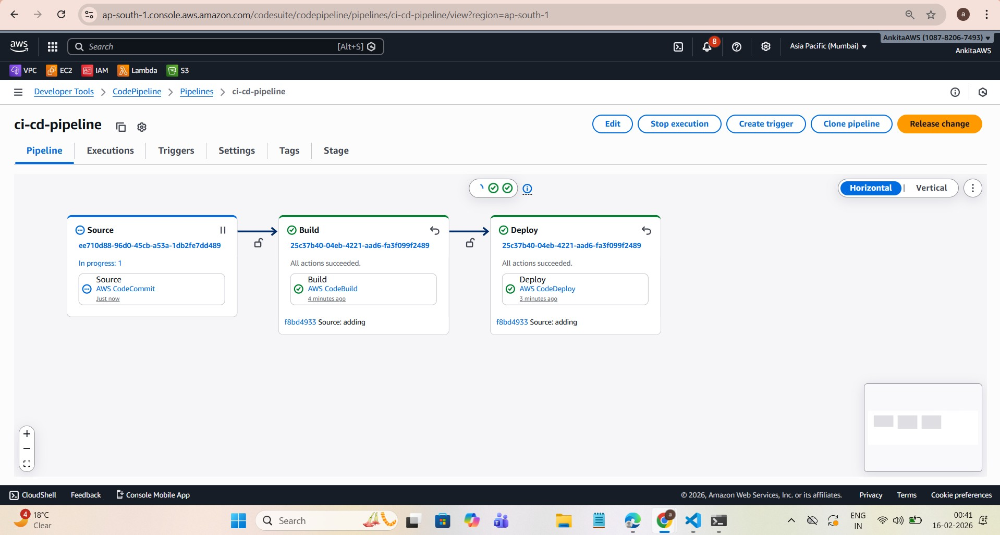
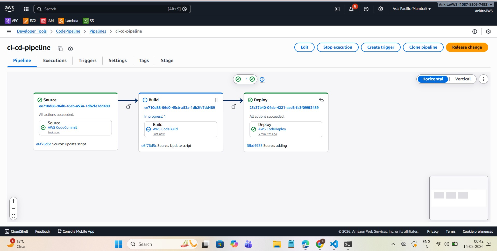
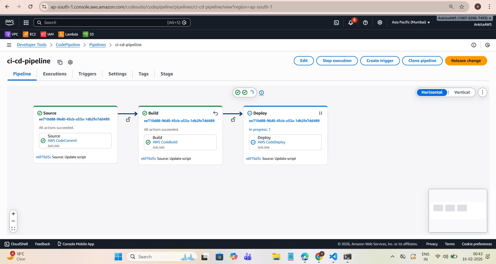


### 🎉 FINAL RESULT
Then open:
```
http://<EC2-Public-IP>:8080
```

You will see :
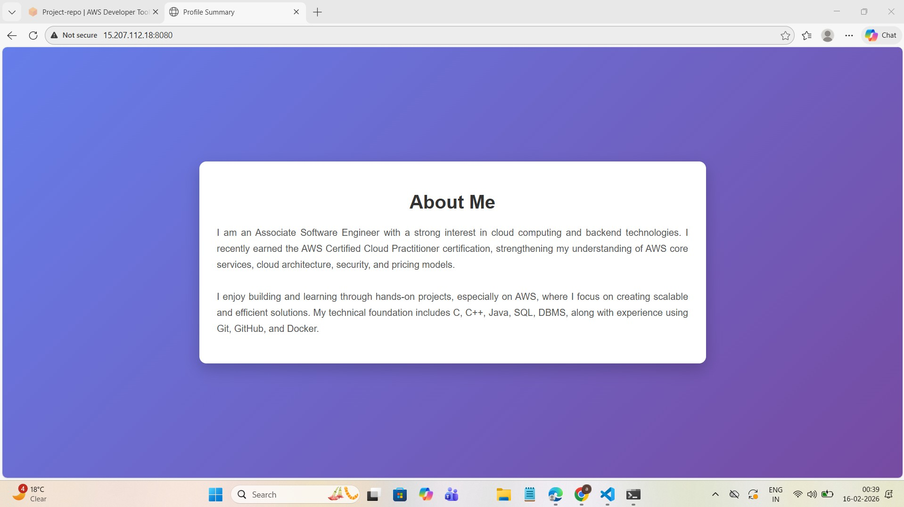

---

### Again we will make small change in script.js

Then:
```
git add .
git commit -m "test pipeline"
git push
```
Pipeline will automatically trigger.

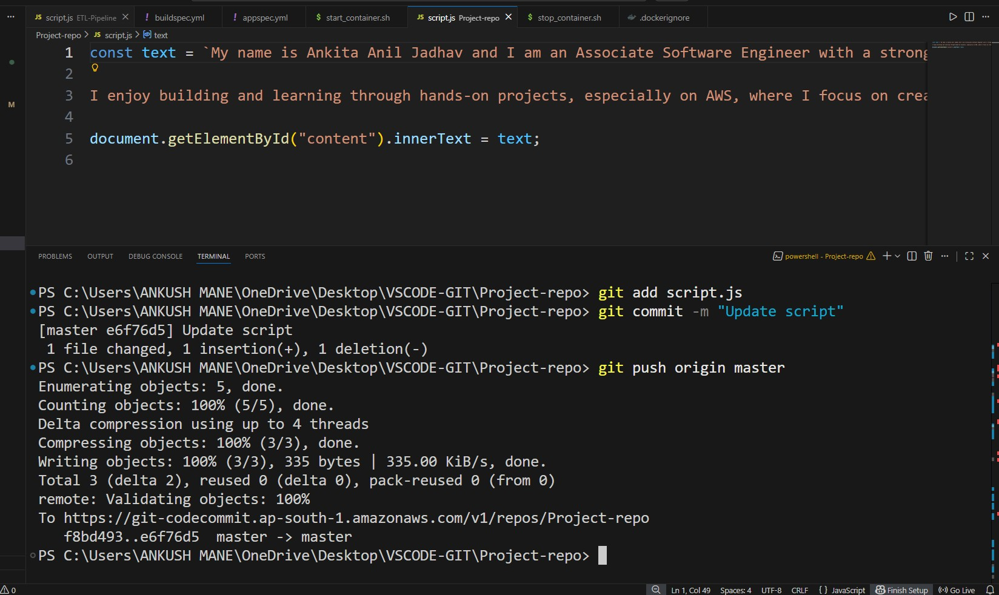

### 🎉 Result 

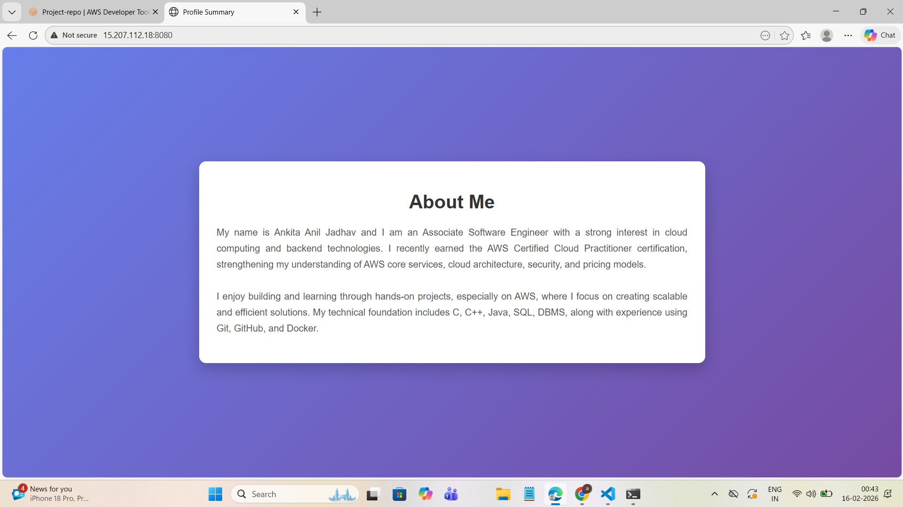

#### Updated version should appear 🚀


